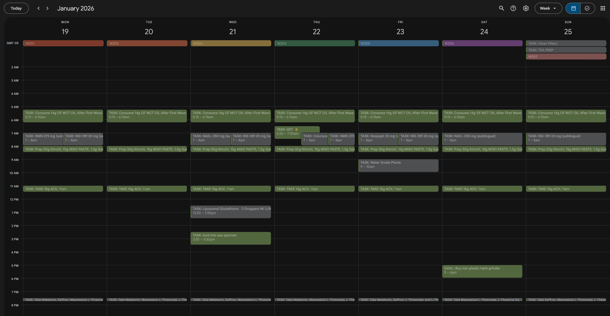
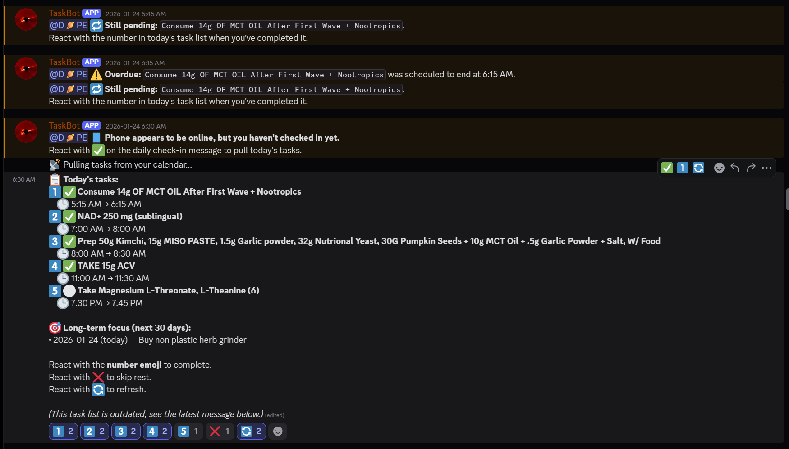

# Discord-Task-Bot 🗓️🤖

A persistent, high-intensity task bot that forces you to stick to your schedule. It links directly to your Google Calendar, requires a daily check-in to pull your tasks, and nags you with automated reminders until you mark them complete.

Built for maximum accountability, it manages your day by pushing your schedule directly into Discord where you'll actually see it.

| Google Calendar Input (The Plan) | Discord Bot Output (The Reality) |
| :--- | :--- |
|  |  |

## 🌟 Features

* **Auto-Syncing Task Board:** Pulls today's schedule from Google Calendar and **auto-refreshes every minute** to reflect any calendar changes. Use number reactions (`1️⃣`, `2️⃣`, etc.) to complete tasks, `❌` to skip, or `🔄` for an instant manual sync. *(Note: Supports up to 10 interactive tasks per day).*
* **Aggressive Nagging System:** Alerts you when a task window begins, warns you when it's ending, and repeats reminders every 30 minutes until you finally click the checkmark. *(All-Day tasks only ping you once at the start of the day and once at the end of the day to minimize noise).*
* **Live Time-State UI:** The task board updates live based on the clock. It color-codes tasks according to their scheduled window:
    * ⚪ **Pending:** Default state.
    * 🟡 **Upcoming:** Starts within 20 minutes (configurable).
    * 🟠 **Active:** Currently within the scheduled time block.
    * 🔴 **Closing/Overdue:** The window is almost closed or the end time has passed.
* **Crash-Resistant State:** Saves your daily progress locally. If the bot restarts or disconnects, it will automatically find your active task board message and resume tracking where it left off.
* **Local Network Wake-Tracking:** Automatically pings your phone's local IP address. If it detects your phone connected to the Wi-Fi but you haven't checked in yet, it pings your Discord to wake you up.
* **Long-Term Goal Lookahead:** Pulls non-urgent `GOAL:` events from the next 30 days to keep your big-picture focus visible beneath your daily tasks without clogging your immediate schedule.
* **End-of-Day Summaries:** Generates a clean report of Completed vs. Skipped tasks, tracks your "time drift" (how late you finished tasks on average vs. your calendar), and previews tomorrow.

---

## 🛠️ Quick Start

### 1. Prerequisites
* Python 3.12+ (Or Docker)
* A Discord Bot Token (Ensure the **Message Content Intent** and **Server Members Intent** are enabled in the Discord Developer Portal).
* A Google Cloud Project with the **Google Calendar API** enabled.

### 2. Installation
Clone the repository and install the requirements:
```bash
git clone https://github.com/NickWinston123/Discord-Task-Bot.git
cd Discord-Task-Bot
pip install -r requirements.txt
```

### 3. Setup Configuration
Copy the `.env.example` file to `.env` and configure it with your specific IDs:
```bash
cp .env.example .env
```
*(You will need your Discord `CHANNEL_ID` and your personal `PRIMARY_USER_ID` so the bot knows who to ping).*

**Important Local Setup Note:** By default, the bot assumes it is running in Docker and looks for credentials in `/app/config`. If you are running this locally via Python, ensure you add `CONFIG_DIR=./config` to your `.env` file!

### 4. Authenticate Google Calendar
1. In your Google Cloud Console, generate an OAuth 2.0 Client ID (Desktop App type).
2. Download the JSON file, rename it to `credentials.json`, and place it in your local `config` folder.
3. Run the initialization script to authorize the bot:
```bash
python init_gcal.py
```
4. A URL will appear in the terminal. Open it, log in, and authorize the app. A `token.json` file will be generated.
5. Ensure both `credentials.json` and `token.json` are inside your configured `CONFIG_DIR` (e.g., `./config`).

### 5. Run the Bot
```bash
python bot.py
```

---

## 📅 How to Format Your Google Calendar

The bot ignores normal meetings or events. It only pulls events with specific prefixes (configurable in `.env`).

* **Tasks:** Name your event `TASK: Take Bromelain`. It can be a timed event (12:00 PM - 3:00 PM) or an All-Day event. *(Limit: 10 tasks per day).*
* **Goals:** Name your event `GOAL: Finish website prototype`. These will appear at the bottom of your task board as long-term reminders.

---

## 🤖 Commands & Usage

* **Daily Prompt:** The bot will naturally prompt you with a 🌅 Check-in message at the start of your day. React with ✅ to generate your board.
* **`!checkin`**: Use this command in your channel to manually force the bot to pull your board immediately (useful if you missed the prompt or started the bot late).

---

## ⚙️ Advanced Environment Variables

You can fine-tune the bot's aggression and timing in your `.env` file:

* `START_OF_DAY_HOUR` (Default: `4`) - The hour (24h) the bot considers the "start of your day" to send the check-in prompt.
* `END_OF_DAY_HOUR` (Default: `22`) - The hour (10 PM) the bot sends your daily summary and considers all-day tasks overdue.
* `REMIND_INTERVAL_MINUTES` (Default: `30`) - How often the bot will nag you for an active, pending timed task.
* `UPCOMING_SOON_MINUTES` (Default: `20`) - How many minutes before a task starts that it turns 🟡 Yellow.
* `PHONE_PING_ENABLED` (Default: `False`) - Set to `True` and provide `WIFI_DEVICE_IP` to enable phone-wake tracking. 

---

## 🐳 Docker Deployment

A `Dockerfile` and `start.sh.example` are included for easy deployment on home servers (like Proxmox, Unraid, or a Raspberry Pi).

```bash
cp start.sh.example start.sh
chmod +x start.sh
./start.sh
```
*Note: To use the `PHONE_PING_ENABLED` feature inside Docker, you must run the container on the `host` network so it can reach your local subnet to ping your phone.*